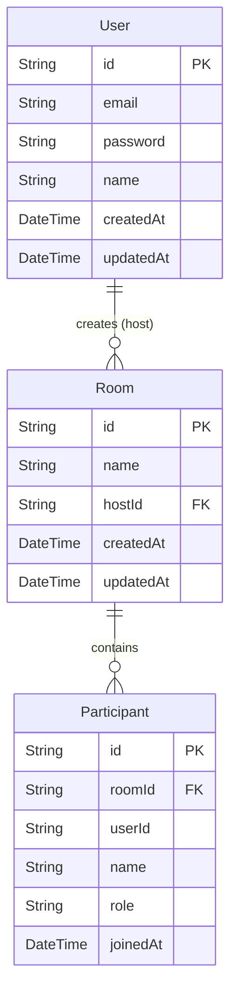

# Database Schema Documentation

This document describes the database schema used in the application. It is implemented using PostgreSQL and managed via Prisma ORM.

## Entity Relationship Diagram (ERD)

## Models

### 1. User
Represents a registered user who can host meetings.
*   **id**: Unique identifier (UUID).
*   **email**: User's email address (Unique).
*   **password**: Hashed password.
*   **name**: Display name of the host.
*   **rooms**: One-to-many relationship with `Room` (rooms created by this user).

### 2. Room
Represents a video conferencing session.
*   **id**: Unique room identifier (Slug/UUID), used in the invite URL.
*   **name**: Descriptive name of the room.
*   **hostId**: Foreign key linking to the `User` who created the room.
*   **participants**: One-to-many relationship with `Participant` (users currently in the room).

### 3. Participant
Represents a user (Guest or Host) currently joined in a room.
*   **id**: Unique identifier for the session.
*   **roomId**: Foreign key linking to the `Room`.
*   **userId**: Ephemeral or persistent ID for the user in the context of the room.
*   **name**: Display name shown in the video grid.
*   **role**: Role of the participant (e.g., `HOST`, `GUEST`).
*   **joinedAt**: Timestamp when the user joined.

## Relationships

*   **User -> Room**: One User can create many Rooms. A Room belongs to exactly one User (Host).
*   **Room -> Participant**: One Room can have many Participants. A Participant belongs to exactly one Room.
